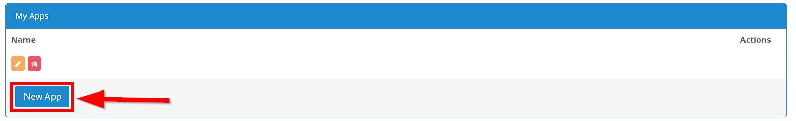
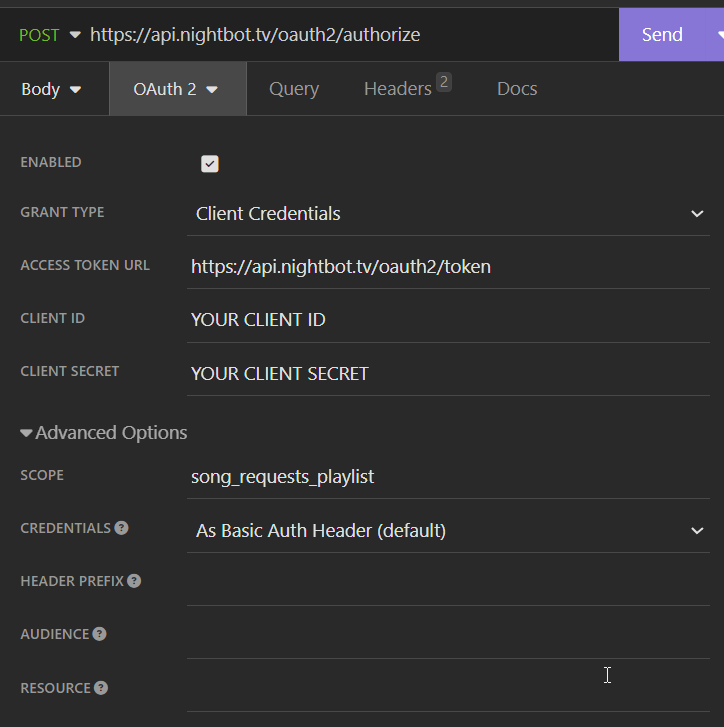
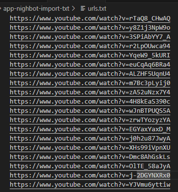
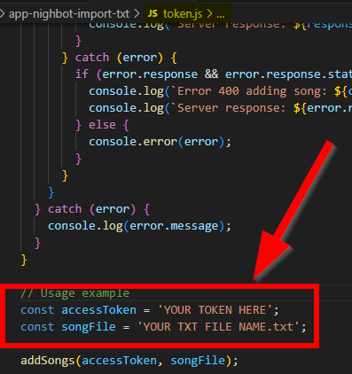
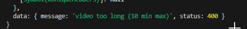

# Add Songs from txt file to Nightbot Playlist

This code allows you to add songs to Nightbot's playlist using the Nightbot API from txt file that contains songs urls.

## Installation

1. Clone the repository: `git clone https://github.com/sistemasitpro/app-nighbot.git`

## Usage

To add songs to Nightbot, follow these steps:

1. Create an application on the [Nighbot Account Aplication Dashboard](https://nightbot.tv/account/applications) to obtain a client id and secret oauth2.

  1.1 When you create the application it will ⚠️**generate a client id and a secret id**⚠️, save them to enter them later in the insomnia postman and get your token.

2. You can use a [POSTMAN](https://www.postman.com/) or [INSOMNIA](https://insomnia.rest/) software to obtain this token using OAUTH2

3. Create a text file containing a list of YouTube or Souncloud url songs, with each song on a new line.

4. Customize the code by replacing `YOUR TOKEN HERE` with your Nightbot access token and `YOUR TXT FILE NAME.txt` with the name of your text file.

5. Run the code: `node token.js`
> [!WARNING] 
> If it generates an error in any of the links, it is possible that the video you are trying to add is longer than 10 minutes or is shorter than 30 seconds **(nighbot does not allow + 10min and less 30 seconds).**

The code will read the text file, remove any newline or whitespace characters at the end of each line, and make a POST request to the Nightbot API to add each song to the playlist.
And the result is:

THANK YOU FOR READ THIS REPOSITORY AND CONGRATULATIONS.
## Contributing

Contributions to this code are welcome! If you find a bug or have a feature request, please open an issue or submit a pull request.

## License

This code is open source and released under the [Apache 2.0 License](LICENSE).